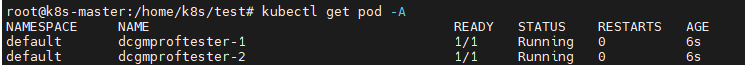
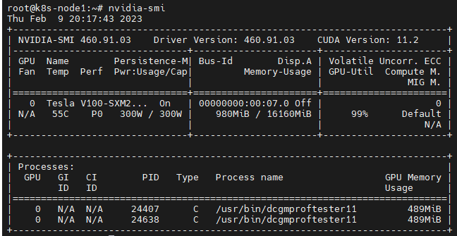

# Time-slicing实验

首先配置

参考官网https://github.com/NVIDIA/k8s-device-plugin#deployment-via-helm

参考博客https://blog.csdn.net/qq_43684922/article/details/126906146

实际搭建起来之后，可以在单GPU机器同时启用多个需要GPU的pod。如下图所示

查看两个pod运行状态

两个pod不存在隔离，只要其中一个停止，另外一个一定直接出错停止。